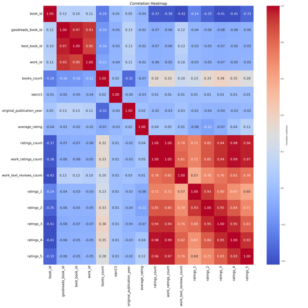

# Automated Analysis

Generated story:
# The Wealth of Words: A Data Analysis Journey Through a 10,000-Book Dataset

In an age where digital literature flourishes, a treasure trove of data about books beckons for exploration and understanding. With this post, we dive deep into a significant dataset comprising 10,000 entries that encapsulates a vast world of literary content, authorial voices, and reader experiences.

## Dataset Overview

The dataset is structured in a two-dimensional format featuring 10,000 rows and 23 columns—each representing essential attributes of various books. We aim to unravel the stories hidden within these rows, presenting a broad spectrum of insights surrounding authors, publication years, ratings, and more.

### Key Attributes

1. **Identifiers**: Several columns like `book_id`, `goodreads_book_id`, and `work_id` help uniquely identify each book, ensuring straightforward referencing throughout our analysis.
   
2. **Author Information**: The `authors` column reveals a large creativity pool, with unique contributions from 4,664 distinct authors. Notably, the famed Stephen King stands out with a frequency of 60 mentions, illustrating his prolific presence in contemporary literature.

3. **Publication Year**: On average, the books were published in the late 1980s, with a mean publication year around 1982. This insight helps us contextualize the time period of these literary works and might attract scholarly attention on the evolution of writing styles and themes.

4. **Rating Metrics**: An immensely valuable aspect of the dataset is the feedback system expressed through `average_rating`, `ratings_count`, and the distribution of ratings from 1 to 5 stars. The mean average rating of 4.00 out of 5 indicates a generally favorable perception of the books, while the ratings distribution—particularly the higher values—suggests public engagement and interest in analyzing the quality of literary works.

5. **Missing Data**: While the dataset is rich, it’s not without its gaps. Notable areas of missing data include ISBN numbers and some original titles. This poses a potential limitation when integrating this dataset with other literary datasets for comprehensive analyses.

### Summary Statistics

A brief glance at the summary statistics shows that among the 10,000 books recorded, the average ratings count is an impressive 54,001. Additionally, the books are well-received, as evidenced by the average rating score of 4.00, showcasing a vibrant community of readers engaging broadly across genres.

## Insights and Implications

This dataset serves as a powerful tool for a multitude of stakeholders:

- **Authors & Publishers**: Understanding popular genres and trends based on average ratings and reader counts can help guide publishing decisions and targeted marketing efforts geared towards high-engagement demographics.

- **Reading Platforms**: Insights drawn from this analysis can empower platforms like Goodreads, Kindle, or other book services to better recommend titles based on user behavior patterns and demographic interests.

- **Researchers**: Scholars can leverage this information to study readership trends, literary evolution over decades, and the impact of specific authors’ works on the literary landscape.

## Next Steps

Despite the depth of information already gathered, numerous opportunities lie ahead for deeper insights:

1. **Advanced Analytics**: Incorporating machine learning algorithms to cluster books by similar themes or reader demographics could open new pathways for personalized reading experiences.

2. **Data Enrichment**: Enhancing the dataset by cross-referencing with additional literary databases could mitigate missing values, providing a more thorough resource for analysis.

3. **Reader Sentiment Analysis**: Analyzing user reviews in conjunction with ratings counts would offer nuanced insights into reader sentiments, contributing richness to the numerical data.

4. **Publication Year Correlation**: Further analyzing the relationship between publication year and average ratings might reveal shifts in literary quality or preference over time.

## Conclusion

This exploration of a comprehensive book dataset is just the beginning. By applying robust analytical techniques and seeking creative augmentation of the existing dataset, we can unlock a deeper understanding of the literary world, and understand the ever-evolving relationship between books, readers, and the cultural zeitgeist they endure. 

Join us in the next chapter of this data-driven journey, as we continue unraveling stories hidden in the numbers, one dataset at a time.

## Visualizations

