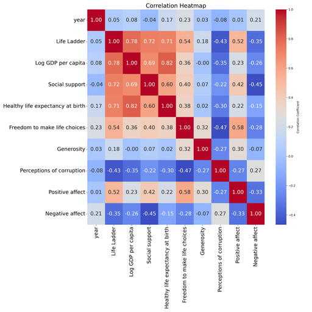

# Automated Analysis

Generated story:
# Exploring Global Well-Being: A Dive into the Life Ladder Data

## Introduction
In the quest for understanding global well-being, a recent dataset has revealed interesting insights into various countries, their economic conditions, and socio-emotional perceptions. This analysis focuses on data containing 2363 entries across 11 key variables, including economic metrics like GDP per capita and social metrics like life satisfaction levels, otherwise known as the "Life Ladder." As we delve into this dataset, we can uncover trends and patterns that can guide policy decisions and individual understanding of well-being around the world.

## Dataset Overview
The provided dataset contains information on countries, the year of measurement, and metrics that capture well-being, economic stability, social support, health, freedom, generosity, perceptions of corruption, and emotional states. 

### Key Variables:
1. **Life Ladder**: A subjective measure of well-being where respondents rate their lives on a scale of 0 to 10.
2. **Log GDP per capita**: A logarithmic representation of economic output per person, serving as an indicator of economic health.
3. **Social Support**: Capturing individuals’ feelings of having support from family and friends.
4. **Healthy Life Expectancy at Birth**: An estimate of the average number of years a newborn is expected to live in good health.
5. **Freedom to Make Life Choices**: This measures the extent to which individuals feel free to make choices that shape their lives.
6. **Generosity**: A measure that might reflect societal tendencies towards giving and support.
7. **Perceptions of Corruption**: This indicates how citizens view corruption levels in their countries.
8. **Positive and Negative Affect**: Metrics reflecting the emotional states prevalent in a society.

### Missing Values
As we examined the data, several variables displayed missing values:
- **Log GDP per capita**: 28 missing entries.
- **Social Support**: 13 missing entries.
- **Healthy Life Expectancy at Birth**: 63 missing entries.
- **Freedom to Make Life Choices**: 36 missing entries.
- **Generosity**: 81 missing entries.
- **Perceptions of Corruption**: 125 missing entries.
- **Positive Affect**: 24 missing entries.
- **Negative Affect**: 16 missing entries.

These missing values highlight the need for careful consideration in data interpretation, as they may impact the accuracy of insights drawn from the dataset.

## Summary Statistics
A peek into the summary statistics reveals average well-being indicators:
- **Life Ladder**: The mean score stands at 5.48, suggesting a moderate level of life satisfaction among the surveyed populations.
- **Log GDP per capita**: Averaging at 9.40 indicates varying degrees of economic prosperity across countries.
- **Social Support**: A mean score of 0.81 suggests strong community ties or available resources for individuals, but this varies widely (0.23 to 0.99).
- **Healthy life expectancy at birth**: Averaging at 63.40 years indicates a significant variance in health outcomes internationally.
- **Freedom Index**: A mean of 0.75 portrays generally positive perceptions of individual freedom, though some still experience restrictions.

## Insights and Implications
The data suggests that there is a relationship between economic prosperity (Log GDP per capita) and subjective well-being (Life Ladder). As countries become more economically advanced, there appears to be a corresponding increase in life satisfaction. However, this data must be interpreted with caution due to the inconsistencies and gaps highlighted earlier.

Moreover, stronger social support correlates with higher life satisfaction, underlining the importance of community and family ties in enhancing individual well-being. On the other hand, perceptions of corruption weigh heavily on life satisfaction, implying that strategies targeting governmental transparency may help improve public sentiment and overall happiness levels.

### Next Steps
Moving forward, we should consider conducting advanced analyses such as regression modeling to quantitatively assess the impact of each variable on life satisfaction levels. Additionally, filling in the gaps of missing data through imputation methods or gathering supplemental data from additional sources can enhance the robustness of our conclusions.

Lastly, it would be prudent to investigate individual countries in greater depth, as localized insights may provide more targeted and effective strategies for improving well-being in specific regions.

## Conclusion
The exploration of well-being through this dataset brings forth a nuanced understanding of various factors that contribute to life satisfaction across different countries. While the initial findings provide a sound basis for further investigation, continued research is essential as we aim to craft better policies and interventions that foster happier, healthier societies globally.

## Visualizations

