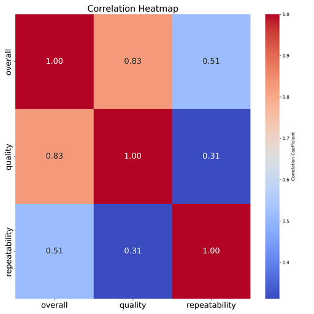

# Automated Analysis

Generated story:
# Unpacking Movie Reviews: Insights from a Detailed Data Analysis

## Introduction

In the ever-evolving landscape of cinema, understanding audience perceptions through reviews has become crucial. Harnessing data can provide us with remarkable insights into what resonates with viewers and what doesn't. In this analysis, we explored a dataset encompassing 2,652 movie reviews with various attributes including date, language, title, reviewer, and ratings for overall enjoyment, quality, and repeatability. Let’s delve into the findings and their implications.

## Data Overview

Our dataset comprises the following features:

- **date**: The date the review was posted (with some missing values).
- **language**: The language of the movie.
- **type**: The type of the media (predominantly movies).
- **title**: The title of the movie reviewed.
- **by**: The name of the reviewer (a significant number of entries are missing).
- **overall**: The overall rating of the movie, on a scale of 1 to 5.
- **quality**: The perceived quality of the movie.
- **repeatability**: Indicating how likely the reviewer is to recommend watching the movie again.

## Key Findings

### Missing Values
The dataset presented some challenges, with 99 missing dates and an even greater number of missing reviewers (262). This could skew the analysis and conclusions we draw if we do not address these gaps effectively.

### Language and Type
Interestingly, the reviews show a strong preference towards English-language films, comprising a significant 49% of the total data. The overwhelming majority of reviews pertain to movies, with only a few entries assigned to other media types. This indicates a concentrated focus that could heavily influence trends and recommendations based on viewer familiarity.

### Review Insights
- **Overall Ratings**: The mean overall rating is approximately 3.05, suggesting a neutral to slightly positive reception overall by the viewers. 
- **Quality Ratings**: The average quality score is slightly higher at 3.21, indicating that while viewers enjoyed the films, they may have perceived them more favorably regarding technical aspects.
- **Repeatability Ratings**: The repeatability rating sits at an average of 1.49, implying many movies are not being recommended for rewatch, which can indicate a lack of emotional impact or engagement.

The most frequent review entries come from "Kiefer Sutherland," indicating a potential clustering of reviews from certain critics that could lead to biased outcomes in interpretation.

## Implications

This analysis opens various avenues for further exploration. Given the centrality of English-language films, it raises the question of whether non-English films are underrepresented or simply less favored in viewer reviews. Additionally, the repeated acknowledgment of Kiefer Sutherland could be a gateway into analyzing if his reviews bear more influence than others.

The neutral average ratings point towards an opportunity for filmmakers and marketers to reassess their strategies. How can they infuse transformative elements into their movies that foster deeper connections with audiences? 

## Next Steps

1. **Address Missing Values**: Imputing or analyzing the patterns behind missing dates and reviewer entries will enhance data integrity.
2. **Analyze Non-English Films**: A further breakdown of non-English entries could yield insights into diverse cultural influences in cinema.
3. **Investigate Reviewer Influence**: Understanding how certain reviewers impact movie ratings can provide critical insights into audience behavior and content strategy.
4. **Temporal Analysis**: Exploring the trends over time could reveal how movie ratings evolve, relating to external factors like genre shifts, actor performances, or social contexts.

## Conclusion

Our examination of the movie reviews dataset sheds light on several significant trends and findings that warrant deeper inquiry. With a structured approach, we could leverage these insights to inform filmmakers, critics, and audiences alike about the nuances that govern the film viewing experience. As we continue to analyze and interpret these reviews, we pave the way for a richer understanding of cinema, fostering a convergence of data with artistic expression.

## Visualizations

